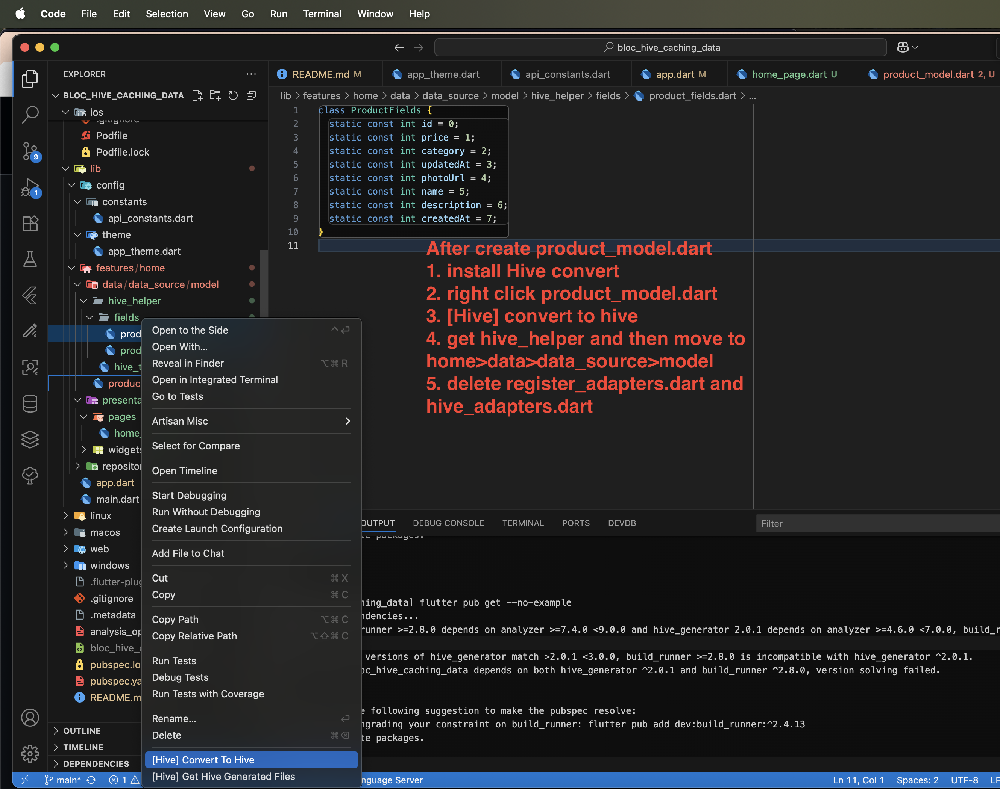

# bloc_hive_caching_data

A new Flutter project with BLOC HIVE CACHING DATA.
https://www.youtube.com/watch?v=GHWPfxpkBoM&t=16s
```
git clone https://github.com/AmirBayat0/Flutter-caching-data-Bloc-And-Hive.git
```
Sample API
```
https://api.slingacademy.com/v1/sample-data/products?&limit=30
```

## Vscode extension
```
Hive Object Converter
```

## Dependencies
```
 # Theme
  flex_color_scheme: ^8.3.0
  # show image from internet and keep them in the cache directory 
  cached_network_image: ^3.4.1
  # Icon 
  remixicon: ^1.4.1
  iconly: ^1.0.1
  # date time
  intl: ^0.20.2
  # log 
  logger: ^2.6.1
  # HIVE
  hive: ^2.2.3
  hive_flutter: ^1.1.0
  hive_generator: ^2.0.0
  build_runner: ^2.4.13
  ```
  ## After Create product_model.dart
  
  if everything is no error with out part 'product_model.g.dart'; has underline red
    Run hive generateor build_runner on terminal
    ```
    flutter pub run build_runner build --delete-conflicting-outputs
    ```
